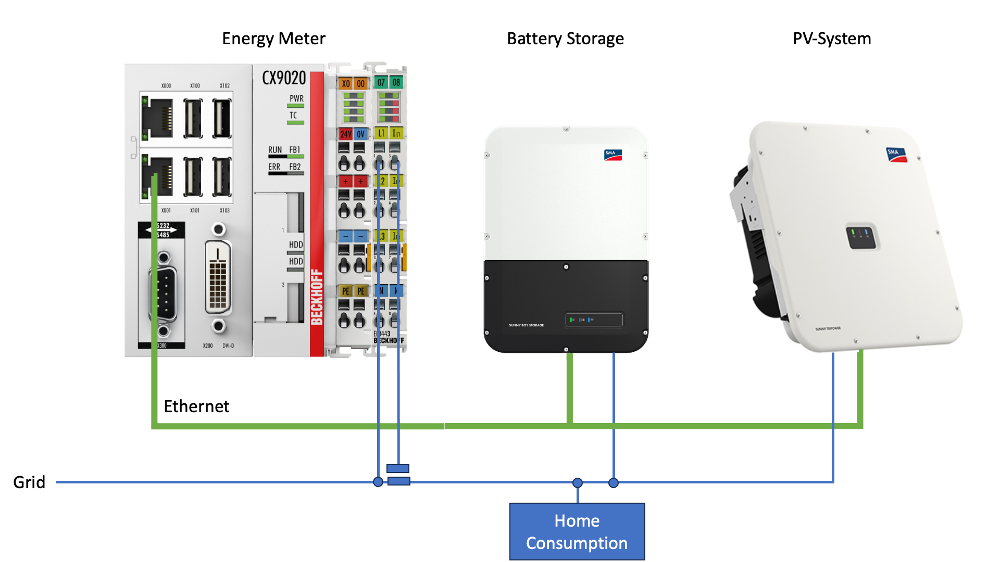

# TwinCAT-SMA-Energymeter
_This project is not affiliated, associated, authorized, endorsed by, or in any way officially connected with 
SMA Solar Technology AG or Beckhoff Automation GmbH & Co. KG, or any of its subsidiaries or its affiliates._

_This project is offered “as-is”, without warranty, and disclaiming liability for damages resulting from using the projects._

This project implements an energy meter for inverters from SMA. Due to the usage of a power measurement unit on the grid connection point, the implementation is able to provide the current grid parameters to the inverter via speedwire. The emulation of the SMA speedwire protocoll was inspired by [this](https://github.com/J0B10/SMA-Speedwire) work.

  

The example project shown in the figure comprises a CX9020 embedded industrial PC and an EL3443 energy measurement terminal measuring the energy flow on the grid connection point. 

## Requirements 
The software implementation was created using TwinCAT 3. It relies on the [TF6310](https://www.beckhoff.com/de-de/produkte/automation/twincat/tfxxxx-twincat-3-functions/tf6xxx-connectivity/tf6310.html) connectivity supplement for TwinCAT 3.

According to measure grid parameters like voltage, current, frequency and active power, the project was tested with the Beckhoff EL3443 EtherCAT terminal. However, also other energy measurement terminals from Beckhoff, e.g, EL3453, are well suited. 

